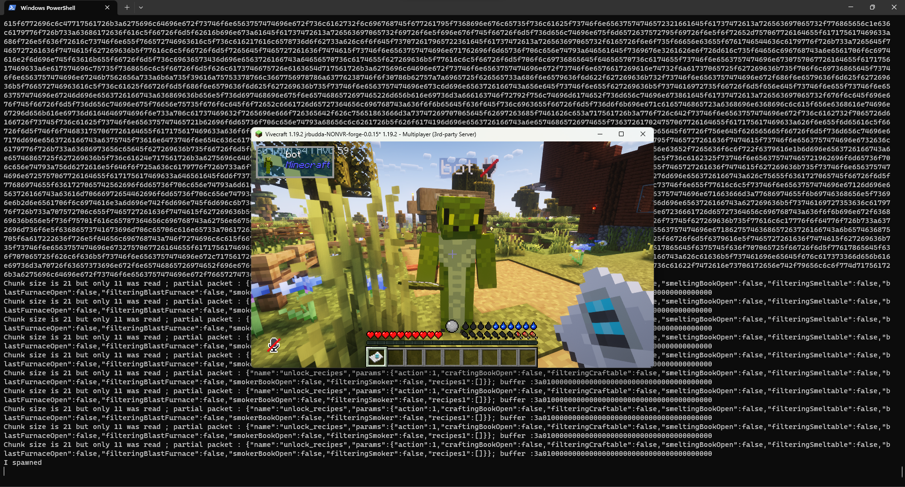

# minecraft-protocol-forge

## Fork doc
Modyfing existing code for FML2, I managed to make minecraft-protocol-forge and, by extension, minecraft-protocol and mineflayer to work with FML3 protocol (Minecraft with Forge, 1.18+). This is mere proof of concept, I don't have time to support this and things can still go wrong. However, feel free to fork it further or improve upon.

Few things to consider. First of all, make sure that your protodef library is of version is higher than 1.15.0 (minecraft-protocol-forge from [npm repository](https://www.npmjs.com/package/minecraft-protocol-forge) asks for 0.25.0 version of protodef, which breaks things). 

And second, take a look at examples. I added two mineflayer examples that you can start with. [One](./examples/mineflayer_forge_simplelogin) of them works with [SimpleLogin](https://www.curseforge.com/minecraft/mc-mods/simple-login) mod that adds more security for offline servers. Use [another mineflayer example](./examples/mineflayer_forge) if you don't use SimpleLogin. Now, trying to login to server might give you this error with some mods (like TeamAbnormals ones):
```
...\mineflayer\lib\plugins\entities.js:202
    entity.type = entityData.type || 'object'
                             ^

TypeError: Cannot read properties of undefined (reading 'type')
```

I'm not sure why it happens, but it is easily fixable by adding if statement around `entity.type = entityData.type || 'object'` in [entities.js](https://github.com/PrismarineJS/mineflayer/blob/d764706f53dbe7ba16cf49645d66d192a309cc5c/lib/plugins/entities.js#L203) file from mineflayer:
```
    if (entityData) {
        entity.type = entityData.type || 'object'
    }
```

With this error away, you can finally connect to modded Minecraft 1.18+ server with Forge mods. Below is the screenshot of me connecting bot to private Minecraft server in offline mode, with 106 mods (including [SimpleLogin](https://www.curseforge.com/minecraft/mc-mods/simple-login) mod and also [OfflineSkins](https://www.curseforge.com/minecraft/mc-mods/offlineskins) mod to restore online mode skins). Even though command line gives a lot of `partial packet` messages, bot still connects with a lizard skin thanks to OfflineSkins mod.



## Original doc

[](http://npmjs.com/package/minecraft-protocol-forge)
[](https://gitter.im/PrismarineJS/node-minecraft-protocol)

Adds FML/Forge support to [node-minecraft-protocol](https://github.com/PrismarineJS/node-minecraft-protocol) (requires 0.17+)

## Features

* Supports the `FML|HS` client handshake
* Adds automatic Forge mod detection to node-minecraft-protocol's auto-versioning

## Usage

Installable as a plugin for use with node-minecraft-protocol:

```javascript
var mc = require('minecraft-protocol');
var forgeHandshake = require('minecraft-protocol-forge').forgeHandshake;
var client = mc.createClient({
    host: host,
    port: port,
    username: username,
    password: password
});

forgeHandshake(client, {forgeMods: [
  { modid: 'mcp', version: '9.18' },
  { modid: 'FML', version: '8.0.99.99' },
  { modid: 'Forge', version: '11.15.0.1715' },
  { modid: 'IronChest', version: '6.0.121.768' }
]});
```

The `forgeMods` option is an array of modification identifiers and versions to present
to the server. Servers will kick the client if they do not have the required mods.

To automatically present the list of mods offered by the server, the `autoVersionForge`
plugin for node-minecraft-protocol's `autoVersion` (activated by `version: false`) can
be used:

```javascript
var mc = require('minecraft-protocol');
var autoVersionForge = require('minecraft-protocol-forge').autoVersionForge;
var client = mc.createClient({
    version: false,
    host: host,
    port: port,
    username: username,
    password: password
});

autoVersionForge(client);
```

This will automatically install the `forgeHandshake` plugin, with the appropriate mods,
if the server advertises itself as Forge/FML. Useful for connecting to servers you don't
know if they are Forge or not, or what mods they are using.

## Example

    npm start

## Installation

`npm install minecraft-protocol-forge`

## Debugging

You can enable some protocol debugging output using `NODE_DEBUG` environment variable:

```bash
NODE_DEBUG="minecraft-protocol-forge" node [...]
```

## History

See https://github.com/PrismarineJS/node-minecraft-protocol/pull/326
